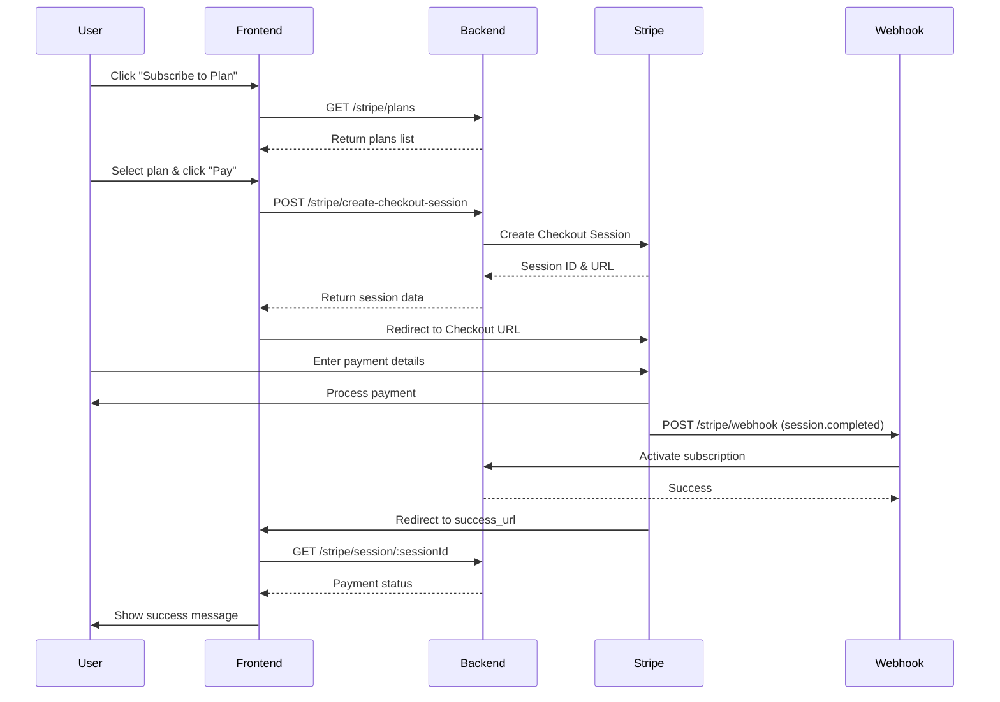

# Stripe Payment Integration Guide

## 📋 Table of Contents
- [Overview](#overview)
- [Quick Start](#quick-start)
- [API Endpoints](#api-endpoints)
- [Payment Flow](#payment-flow)
- [Frontend Integration Steps](#frontend-integration-steps)
- [Webhook Setup](#webhook-setup)
- [Error Handling](#error-handling)
- [Testing](#testing)

---

## 🎯 Overview

This backend provides a complete Stripe payment integration for subscription-based payments. The system handles:
- Subscription plan management
- Checkout session creation
- Payment status tracking
- Automatic subscription activation
- Webhook event processing

**Base URL:** `http://localhost:3000/api/v1`

---

## ⚡ Quick Start

### Prerequisites
1. User must be authenticated (have a valid JWT token)
2. Stripe keys configured in `.env`:
   ```env
   STRIPE_SECRET_KEY=sk_test_...
   STRIPE_PUBLISHABLE_KEY=pk_test_...
   STRIPE_WEBHOOK_SECRET=whsec_...
   ```

### Simple Flow
1. Get available subscription plans
2. User selects a plan
3. Create checkout session
4. Redirect user to Stripe Checkout
5. User completes payment
6. Webhook activates subscription
7. Check payment status

---

## 🔌 API Endpoints

### 1. Get Stripe Configuration
**GET** `/api/v1/stripe/config`

Returns the Stripe publishable key for frontend initialization.

**Authentication:** ❌ Not required

**Request:**
```bash
curl http://localhost:3000/api/v1/stripe/config
```

**Response:**
```json
{
  "publishableKey": "pk_test_...",
  "currency": "usd"
}
```

**Usage in Frontend:**
```javascript
const { publishableKey } = await fetch('/api/v1/stripe/config').then(r => r.json());
const stripe = Stripe(publishableKey);
```

---

### 2. List Subscription Plans
**GET** `/api/v1/stripe/plans`

Get all available subscription plans.

**Authentication:** ❌ Not required

**Request:**
```bash
curl http://localhost:3000/api/v1/stripe/plans
```

**Response:**
```json
[
  {
    "subscription_Plan_id": 1,
    "name": "Basic Plan",
    "price": "9.99",
    "duration_day": "2024-12-31T00:00:00.000Z",
    "description": "Access to basic features",
    "stripe_price_id": null
  },
  {
    "subscription_Plan_id": 2,
    "name": "Premium Plan",
    "price": "29.99",
    "duration_day": "2024-12-31T00:00:00.000Z",
    "description": "Access to all features",
    "stripe_price_id": null
  }
]
```

---

### 3. Create Checkout Session
**POST** `/api/v1/stripe/create-checkout-session`

Creates a Stripe Checkout session for payment.

**Authentication:** ✅ Required (Bearer Token)

**Headers:**
```
Authorization: Bearer <your-jwt-token>
Content-Type: application/json
```

**Request Body:**
```json
{
  "subscription_plan_id": 1,
  "success_url": "http://localhost:5173/payment/success?session_id={CHECKOUT_SESSION_ID}",
  "cancel_url": "http://localhost:5173/payment/cancel"
}
```

**Request Example:**
```bash
curl -X POST http://localhost:3000/api/v1/stripe/create-checkout-session \
  -H "Authorization: Bearer YOUR_JWT_TOKEN" \
  -H "Content-Type: application/json" \
  -d '{
    "subscription_plan_id": 1,
    "success_url": "http://localhost:5173/payment/success?session_id={CHECKOUT_SESSION_ID}",
    "cancel_url": "http://localhost:5173/payment/cancel"
  }'
```

**Response (201):**
```json
{
  "sessionId": "cs_test_a1b2c3...",
  "url": "https://checkout.stripe.com/c/pay/cs_test_a1b2c3..."
}
```

**Error Responses:**
```json
// 400 - Invalid plan ID
{
  "message": "subscription_plan_id must be a positive integer"
}

// 404 - Plan not found
{
  "message": "Subscription plan not found"
}

// 401 - Not authenticated
{
  "message": "Not authorized"
}
```

---

### 4. Get Checkout Session Status
**GET** `/api/v1/stripe/session/:sessionId`

Check the payment status of a checkout session.

**Authentication:** ✅ Required (Bearer Token)

**Request:**
```bash
curl http://localhost:3000/api/v1/stripe/session/cs_test_a1b2c3... \
  -H "Authorization: Bearer YOUR_JWT_TOKEN"
```

**Response:**
```json
{
  "sessionId": "cs_test_a1b2c3...",
  "status": "paid",
  "amountTotal": 999,
  "currency": "usd",
  "subscriptionStatus": "completed",
  "subscriptionId": 123
}
```

**Status Values:**
- `paid` - Payment successful
- `unpaid` - Payment not completed
- `no_payment_required` - Free plan

**Subscription Status Values:**
- `pending` - Waiting for payment
- `completed` - Subscription activated
- `expired` - Checkout session expired

---

### 5. Stripe Webhook
**POST** `/api/v1/stripe/webhook`

Handles Stripe webhook events (automatically called by Stripe).

**Authentication:** ❌ Not required (Stripe signature verification)

**Handled Events:**
- `checkout.session.completed` - Activates subscription
- `checkout.session.expired` - Marks payment as expired

**Note:** This endpoint is called by Stripe, not your frontend.

---

## 🔄 Payment Flow

### Complete User Journey



### Step-by-Step Flow

#### **Step 1: Get Available Plans**
```javascript
const plans = await fetch('/api/v1/stripe/plans').then(r => r.json());
console.log(plans);
// Display plans to user
```

#### **Step 2: Create Checkout Session**
```javascript
const response = await fetch('/api/v1/stripe/create-checkout-session', {
  method: 'POST',
  headers: {
    'Authorization': `Bearer ${userToken}`,
    'Content-Type': 'application/json'
  },
  body: JSON.stringify({
    subscription_plan_id: selectedPlanId,
    success_url: `${window.location.origin}/payment/success?session_id={CHECKOUT_SESSION_ID}`,
    cancel_url: `${window.location.origin}/payment/cancel`
  })
});

const { sessionId, url } = await response.json();
```

#### **Step 3: Redirect to Stripe Checkout**
```javascript
// Option 1: Direct redirect
window.location.href = url;

// Option 2: Using Stripe.js (recommended)
const stripe = Stripe(publishableKey);
await stripe.redirectToCheckout({ sessionId });
```

#### **Step 4: Handle Success**
```javascript
// On success page (e.g., /payment/success)
const urlParams = new URLSearchParams(window.location.search);
const sessionId = urlParams.get('session_id');

if (sessionId) {
  const status = await fetch(`/api/v1/stripe/session/${sessionId}`, {
    headers: {
      'Authorization': `Bearer ${userToken}`
    }
  }).then(r => r.json());
  
  if (status.subscriptionStatus === 'completed') {
    // Show success message
    console.log('Subscription activated!', status);
  } else {
    // Still processing
    console.log('Payment processing...', status);
  }
}
```

---

## 💻 Frontend Integration Steps

### 1. Install Stripe.js
```bash
npm install @stripe/stripe-js
```

### 2. Initialize Stripe
```javascript
// src/lib/stripe.js
import { loadStripe } from '@stripe/stripe-js';

let stripePromise;

export const getStripe = async () => {
  if (!stripePromise) {
    const { publishableKey } = await fetch('/api/v1/stripe/config')
      .then(r => r.json());
    stripePromise = loadStripe(publishableKey);
  }
  return stripePromise;
};
```

### 3. Subscription Plans Page
```javascript
// src/pages/SubscriptionPlans.jsx
import React, { useState, useEffect } from 'react';
import { getStripe } from '../lib/stripe';

function SubscriptionPlans() {
  const [plans, setPlans] = useState([]);
  const [loading, setLoading] = useState(false);

  useEffect(() => {
    // Load plans
    fetch('/api/v1/stripe/plans')
      .then(r => r.json())
      .then(setPlans);
  }, []);

  const handleSubscribe = async (planId) => {
    setLoading(true);
    try {
      // Create checkout session
      const response = await fetch('/api/v1/stripe/create-checkout-session', {
        method: 'POST',
        headers: {
          'Authorization': `Bearer ${localStorage.getItem('token')}`,
          'Content-Type': 'application/json'
        },
        body: JSON.stringify({
          subscription_plan_id: planId,
          success_url: `${window.location.origin}/payment/success?session_id={CHECKOUT_SESSION_ID}`,
          cancel_url: `${window.location.origin}/pricing`
        })
      });

      const { sessionId } = await response.json();

      // Redirect to Stripe Checkout
      const stripe = await getStripe();
      await stripe.redirectToCheckout({ sessionId });
    } catch (error) {
      console.error('Payment error:', error);
      alert('Payment failed. Please try again.');
    } finally {
      setLoading(false);
    }
  };

  return (
    <div className="plans-container">
      <h1>Choose Your Plan</h1>
      <div className="plans-grid">
        {plans.map(plan => (
          <div key={plan.subscription_Plan_id} className="plan-card">
            <h2>{plan.name}</h2>
            <p className="price">${plan.price}</p>
            <p>{plan.description}</p>
            <button 
              onClick={() => handleSubscribe(plan.subscription_Plan_id)}
              disabled={loading}
            >
              {loading ? 'Processing...' : 'Subscribe'}
            </button>
          </div>
        ))}
      </div>
    </div>
  );
}

export default SubscriptionPlans;
```

### 4. Success Page
```javascript
// src/pages/PaymentSuccess.jsx
import React, { useEffect, useState } from 'react';
import { useNavigate, useSearchParams } from 'react-router-dom';

function PaymentSuccess() {
  const [searchParams] = useSearchParams();
  const [status, setStatus] = useState(null);
  const navigate = useNavigate();

  useEffect(() => {
    const sessionId = searchParams.get('session_id');
    
    if (sessionId) {
      // Check payment status
      fetch(`/api/v1/stripe/session/${sessionId}`, {
        headers: {
          'Authorization': `Bearer ${localStorage.getItem('token')}`
        }
      })
        .then(r => r.json())
        .then(data => {
          setStatus(data);
          
          // Redirect to dashboard after 3 seconds
          if (data.subscriptionStatus === 'completed') {
            setTimeout(() => navigate('/dashboard'), 3000);
          }
        })
        .catch(err => console.error('Error fetching status:', err));
    }
  }, [searchParams, navigate]);

  if (!status) {
    return <div>Loading...</div>;
  }

  return (
    <div className="success-container">
      <h1>✅ Payment Successful!</h1>
      <p>Thank you for your subscription.</p>
      <div className="payment-details">
        <p><strong>Amount:</strong> ${(status.amountTotal / 100).toFixed(2)}</p>
        <p><strong>Status:</strong> {status.status}</p>
        <p><strong>Subscription ID:</strong> {status.subscriptionId}</p>
      </div>
      <p>Redirecting to dashboard...</p>
    </div>
  );
}

export default PaymentSuccess;
```

### 5. Cancel Page
```javascript
// src/pages/PaymentCancel.jsx
import React from 'react';
import { Link } from 'react-router-dom';

function PaymentCancel() {
  return (
    <div className="cancel-container">
      <h1>❌ Payment Cancelled</h1>
      <p>Your payment was cancelled. No charges were made.</p>
      <Link to="/pricing">
        <button>Return to Pricing</button>
      </Link>
    </div>
  );
}

export default PaymentCancel;
```

---

## 🔔 Webhook Setup

### 1. Development (Local Testing)

Use Stripe CLI to forward webhooks to your local server:

```bash
# Install Stripe CLI
# https://stripe.com/docs/stripe-cli

# Login to Stripe
stripe login

# Forward webhooks to local server
stripe listen --forward-to localhost:3000/api/v1/stripe/webhook
```

This will give you a webhook secret like `whsec_...`. Add it to your `.env`:
```env
STRIPE_WEBHOOK_SECRET=whsec_...
```

### 2. Production

1. Go to [Stripe Dashboard → Webhooks](https://dashboard.stripe.com/webhooks)
2. Click "Add endpoint"
3. Enter your webhook URL: `https://yourdomain.com/api/v1/stripe/webhook`
4. Select events to listen to:
   - `checkout.session.completed`
   - `checkout.session.expired`
5. Copy the webhook secret and add to your production `.env`

### 3. Test Webhook

```bash
# Send test event
stripe trigger checkout.session.completed
```

---

## ⚠️ Error Handling

### Common Errors and Solutions

#### 1. "Stripe is not configured"
**Error:**
```json
{
  "message": "Stripe is not configured. Set STRIPE_SECRET_KEY in .env"
}
```

**Solution:** Add Stripe keys to `.env` file

---

#### 2. "Not authorized"
**Error:**
```json
{
  "message": "Not authorized"
}
```

**Solution:** Include valid JWT token in Authorization header

---

#### 3. "Subscription plan not found"
**Error:**
```json
{
  "message": "Subscription plan not found"
}
```

**Solution:** 
- Verify the plan ID exists in database
- Check that you're using `subscription_Plan_id` not `id`

---

#### 4. Webhook signature verification failed
**Error:**
```json
{
  "message": "Webhook Error: No signatures found matching the expected signature for payload"
}
```

**Solution:**
- Verify `STRIPE_WEBHOOK_SECRET` is correct
- Use Stripe CLI for local testing
- Check that webhook endpoint receives raw body (already configured in `app.js`)

---

### Frontend Error Handling Example

```javascript
async function handlePayment(planId) {
  try {
    const response = await fetch('/api/v1/stripe/create-checkout-session', {
      method: 'POST',
      headers: {
        'Authorization': `Bearer ${token}`,
        'Content-Type': 'application/json'
      },
      body: JSON.stringify({
        subscription_plan_id: planId,
        success_url: window.location.origin + '/payment/success?session_id={CHECKOUT_SESSION_ID}',
        cancel_url: window.location.origin + '/pricing'
      })
    });

    if (!response.ok) {
      const error = await response.json();
      throw new Error(error.message || 'Payment failed');
    }

    const { sessionId } = await response.json();
    const stripe = await getStripe();
    
    const { error } = await stripe.redirectToCheckout({ sessionId });
    
    if (error) {
      throw new Error(error.message);
    }
  } catch (error) {
    console.error('Payment error:', error);
    
    // Show user-friendly error message
    if (error.message.includes('Not authorized')) {
      alert('Please log in to continue');
      // Redirect to login
    } else if (error.message.includes('plan not found')) {
      alert('This plan is no longer available');
    } else {
      alert('Payment failed. Please try again.');
    }
  }
}
```

---

## 🧪 Testing

### Test Card Numbers

Stripe provides test cards for different scenarios:

| Card Number | Scenario |
|------------|----------|
| `4242 4242 4242 4242` | ✅ Successful payment |
| `4000 0000 0000 9995` | ❌ Declined (insufficient funds) |
| `4000 0000 0000 9987` | ❌ Declined (lost card) |
| `4000 0025 0000 3155` | ✅ Requires authentication (3D Secure) |

**Details for any test card:**
- **Expiry:** Any future date (e.g., `12/34`)
- **CVC:** Any 3 digits (e.g., `123`)
- **ZIP:** Any 5 digits (e.g., `12345`)

### Testing Checklist

- [ ] Get subscription plans
- [ ] Create checkout session with valid token
- [ ] Create checkout session without token (should fail)
- [ ] Redirect to Stripe Checkout
- [ ] Complete payment with test card
- [ ] Verify webhook receives event
- [ ] Check subscription is activated in database
- [ ] Verify success page shows correct data
- [ ] Test cancel flow
- [ ] Test with expired checkout session

### Database Verification

After successful payment, verify in database:

```sql
-- Check subscription created
SELECT * FROM subscription WHERE user_id = YOUR_USER_ID;

-- Check payment record
SELECT * FROM stripe_payment WHERE user_id = YOUR_USER_ID;

-- Check transaction detail
SELECT * FROM transaction_detail WHERE user_id = YOUR_USER_ID;
```

---

## 📊 Database Schema

### Tables Involved in Payment Flow

#### `subscription_Plan`
```sql
subscription_Plan_id | name          | price  | description
---------------------|---------------|--------|------------------
1                    | Basic Plan    | 9.99   | Basic features
2                    | Premium Plan  | 29.99  | All features
```

#### `stripe_payment`
```sql
stripe_payment_id | user_id | stripe_checkout_session_id | amount | status    | subscription_id
------------------|---------|----------------------------|--------|-----------|----------------
1                 | 123     | cs_test_abc123             | 9.99   | completed | 456
```

#### `subscription`
```sql
subscription_id | user_id | subscription_Plan_id | start_date | end_date
----------------|---------|---------------------|------------|------------
456             | 123     | 1                   | 2024-01-01 | 2024-02-01
```

#### `transaction_detail`
```sql
transaction_id | user_id | subscription_id | bank_tx_id     | paid_account
---------------|---------|-----------------|----------------|---------------
789            | 123     | 456             | pi_abc123      | user@email.com
```

---

## 🔐 Security Best Practices

### 1. Token Management
```javascript
// Store JWT securely
localStorage.setItem('token', jwtToken);

// Clear on logout
localStorage.removeItem('token');

// Include in all authenticated requests
headers: {
  'Authorization': `Bearer ${localStorage.getItem('token')}`
}
```

### 2. Webhook Security
- Never disable webhook signature verification
- Use HTTPS in production
- Keep webhook secret secure

### 3. URL Validation
- Always use full URLs for success/cancel URLs
- Validate URLs are from your domain in production

---

## 📞 Support & Resources

### Stripe Resources
- [Stripe Dashboard](https://dashboard.stripe.com/)
- [Stripe API Docs](https://stripe.com/docs/api)
- [Stripe Testing](https://stripe.com/docs/testing)

### API Documentation
- Swagger UI: `http://localhost:3000/api-docs`
- Health Check: `http://localhost:3000/health`

### Common Issues
- If webhook not firing: Check Stripe CLI is running
- If payment not activating: Check server logs for webhook errors
- If redirect failing: Verify success_url and cancel_url format

---

## 🚀 Quick Copy-Paste Integration

### React Component (Complete Example)

```javascript
// StripePayment.jsx
import React, { useState, useEffect } from 'react';
import { loadStripe } from '@stripe/stripe-js';

const API_BASE = 'http://localhost:3000/api/v1';

function StripePayment() {
  const [plans, setPlans] = useState([]);
  const [loading, setLoading] = useState(false);
  const [stripe, setStripe] = useState(null);

  useEffect(() => {
    // Initialize Stripe
    fetch(`${API_BASE}/stripe/config`)
      .then(r => r.json())
      .then(({ publishableKey }) => loadStripe(publishableKey))
      .then(setStripe);

    // Load plans
    fetch(`${API_BASE}/stripe/plans`)
      .then(r => r.json())
      .then(setPlans);
  }, []);

  const handleSubscribe = async (planId) => {
    setLoading(true);
    try {
      const token = localStorage.getItem('token');
      
      const response = await fetch(`${API_BASE}/stripe/create-checkout-session`, {
        method: 'POST',
        headers: {
          'Authorization': `Bearer ${token}`,
          'Content-Type': 'application/json'
        },
        body: JSON.stringify({
          subscription_plan_id: planId,
          success_url: `${window.location.origin}/payment/success?session_id={CHECKOUT_SESSION_ID}`,
          cancel_url: `${window.location.origin}/payment/cancel`
        })
      });

      if (!response.ok) throw new Error('Payment failed');

      const { sessionId } = await response.json();
      await stripe.redirectToCheckout({ sessionId });
    } catch (error) {
      alert('Error: ' + error.message);
    } finally {
      setLoading(false);
    }
  };

  return (
    <div style={{ padding: '20px' }}>
      <h1>Subscribe to a Plan</h1>
      {plans.map(plan => (
        <div key={plan.subscription_Plan_id} style={{ 
          border: '1px solid #ccc', 
          padding: '20px', 
          margin: '10px',
          borderRadius: '8px'
        }}>
          <h2>{plan.name}</h2>
          <p style={{ fontSize: '24px', fontWeight: 'bold' }}>
            ${plan.price}
          </p>
          <p>{plan.description}</p>
          <button 
            onClick={() => handleSubscribe(plan.subscription_Plan_id)}
            disabled={loading || !stripe}
            style={{
              padding: '10px 20px',
              fontSize: '16px',
              cursor: loading || !stripe ? 'not-allowed' : 'pointer',
              backgroundColor: '#5469d4',
              color: 'white',
              border: 'none',
              borderRadius: '4px'
            }}
          >
            {loading ? 'Processing...' : 'Subscribe Now'}
          </button>
        </div>
      ))}
    </div>
  );
}

export default StripePayment;
```

---

**Need help?** Contact the backend team or check the server logs at `/var/log/` or console output.

**Last Updated:** June 2026
